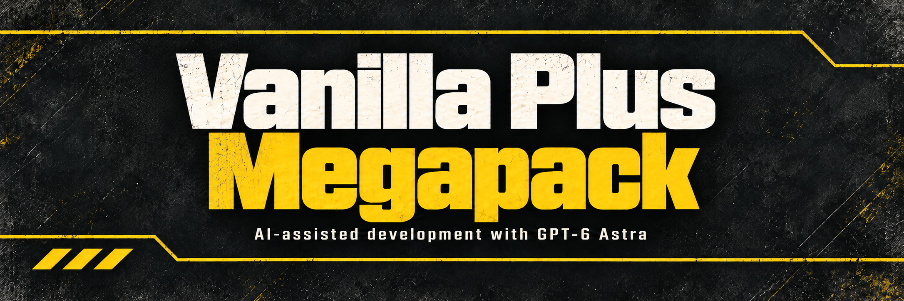

# Vanilla Plus Megapack

Choose which of the eleven bundled CowboyBingus Helldivers 2 gameplay mods to enable in one install. Better stratagem placement, hellpod steering, reinforcement placement, vaulting, shallow-water diving, sentry aim retention, synchronized enemy corpse collision, controllable hover-pack descent, mission constellation forecasts, faster equipment thumbnails, and click-and-drag control of the item-list scrollbars.

**Requires the separately built Bingus Shared Loader v15 or newer.** Install two ZIPs: `Vanilla-Plus-Megapack-v13.zip` and `Bingus-Shared-Loader-v15.zip`. Mod managers do not install the dependency automatically.

Current release: **v13**, with discovery entries for Loader v15. All pinned gameplay implementations are unchanged. See [validation coverage](docs/DISCOVERY_MIGRATION.md). Download [Bingus Shared Loader](https://github.com/CowboyBingus/BingusSharedLoader/releases/latest) from its own repository.

The release also provides an optional [Rows package](docs/ROWS.md), `Vanilla-Plus-Megapack-Rows-v13.zip`. It displays every constellation section at once with the same native styling. Enable either the standard pack or Rows with the shared loader. All other bundled resources are identical.

## Install with Arsenal or HD2MM

1. Close Helldivers 2. Use one mod manager.
2. Replace any previous loader entry with v15 or newer. Disable old megapacks and standalone copies of features you want turned off.
3. Import `Vanilla-Plus-Megapack-v13.zip` and `Bingus-Shared-Loader-v15.zip`, then enable both.
4. With Arsenal's default priority, put **Bingus Shared Loader last**, at the bottom. If first-mod priority is enabled, put the loader first.
5. Open the Megapack's **Options** (sliders button) in Arsenal, or its mod options in HD2MM. Check each mod you want and uncheck each mod you do not want. Confirm/save the selection.
6. **Purge / Deploy**, then launch the game normally. Close the game and repeat these steps whenever you change options.

Each of the eleven options is independent. Select all for the complete pack, any subset for a custom pack, or none to deploy no gameplay features from the pack. Review your choices after importing or updating: initial selections depend on the manager's settings. Both standard and Rows ZIPs offer the same eleven toggles; Rows changes the Know Your Constellation layout.

An unchecked option removes only the pack's copy. An enabled standalone package or another megapack can still activate that feature, so disable those copies as well. Overlapping gameplay entries run once and their callbacks do not stack. If versions differ, manager priority selects the winner.

## Included in v13

| Mod | Version | Effect |
| --- | --- | --- |
| [Better Stratagem Bounce](https://github.com/CowboyBingus/BetterStratagemBounce) | v15.1 | Allows stratagem balls to stick on more usable surfaces. |
| [Hellpod Steering Unlocked](https://github.com/CowboyBingus/HellpodSteeringUnlocked) | v7.1 | Removes the hellpod steering restriction near high ground. |
| [Reinforcement Beacons Fixed](https://github.com/CowboyBingus/ReinforcementBeaconsFixed) | v4.1 | Centers queued reinforcements over their beacon or solo anchor. |
| [Consistent Vaulting](https://github.com/CowboyBingus/ConsistentVaulting) | v8.1 | Adds fresh obstacle checks, higher ledge detection and bounded steep-surface support. |
| [Shallow Water Diving](https://github.com/CowboyBingus/ShallowWaterDiving) | v3.1 | Preserves the standing water reference during a local airborne dive. |
| [Sentry Aim Retention](components/SentryAimRetention/src) | v1.0.8 | Retains sentry aim, improves nearby target handoffs, and pauses broad sweeps, stale-target shots and terrain-obstructed fire. |
| [Enemy Collision Synchronized](components/EnemyCollisionSynchronized/src) | v2.9.1 | Aligns displaced corpse collision and curbs renewed movement after large remote corpses settle. |
| [Controllable Hover Pack](https://github.com/CowboyBingus/ControllableHoverPack) | v1.2 | Press the Jump Pack action again to descend early while retaining native landing assistance. |
| [Know Your Constellation](https://github.com/CowboyBingus/KnowYourConstellation) | v3.13 | Shows local enemy forecasts on mission previews and briefing before choosing a loadout. |
| [Armory Preview Cache](https://github.com/CowboyBingus/ArmoryPreviewCache) | v18 | Caches equipment thumbnails and preloads their assets in Armory and mission briefing. |
| [Clickable Scrollbars](https://github.com/CowboyBingus/ClickableScrollbars) | v2.1 | Clicks and drags the item-list scrollbars, which otherwise answer only to the mouse wheel. |
| [Clickable Scrollbars](https://github.com/CowboyBingus/ClickableScrollbars) | v2.1 | Clicks and drags the item-list scrollbars, which otherwise answer only to the mouse wheel. |
| [Clickable Scrollbars](https://github.com/CowboyBingus/ClickableScrollbars) | v2.1 | Clicks and drags the item-list scrollbars, which otherwise answer only to the mouse wheel. |

All gameplay components are pinned to the source and compiled-resource hashes in `components.lock.json`. Third-party HUD mods and the reserved, unreleased Wide Angle Stratagems module are not included. The shared loader remains a separate dependency with its own repository and updates.

Supported game: Steam build 24826606 / EXE 1.8.45317.0. Each bundled mod retains its behavior and compatibility checks.

## Compatibility and updates

The pack preserves all public gameplay resource names and embeds the exact pinned bytecode inside plaintext discovery entries. It contains no shared startup loader, `boot` replacement or Wwise callback replacement. Existing HUD+ and supported HUD Ballistic Trajectory Overlay compatibility is handled by Bingus Shared Loader. Give the loader winning priority over the supported overlay as described in its instructions.

Replace the megapack ZIP to update its bundled gameplay versions. Updating an individual mod repository does not silently change this pinned pack. The loader can be updated separately.

With at least one pack option selected, check `%LOCALAPPDATA%/CowboyBingus/Helldivers2/Logs/BingusSharedLoader.log` for `mods/cowboybingus/vanilla_plus_megapack: loaded` and the gameplay module entries. All updated gameplay logs use the same folder and keep their existing filenames. For removal, disable the pack and Purge / Deploy. Keep the loader enabled if other dependent mods remain.

[Build from source](CONTRIBUTING.md) | [Technical details](docs/TECHNICAL.md) | [Release notes](docs/RELEASE_NOTES.md) | [Third-party notices](THIRD_PARTY.md) | [Artwork and prompts](assets/ARTWORK.md)

**AI disclosure:** GPT-6 Astra assisted with implementation, tests, documentation and artwork.
